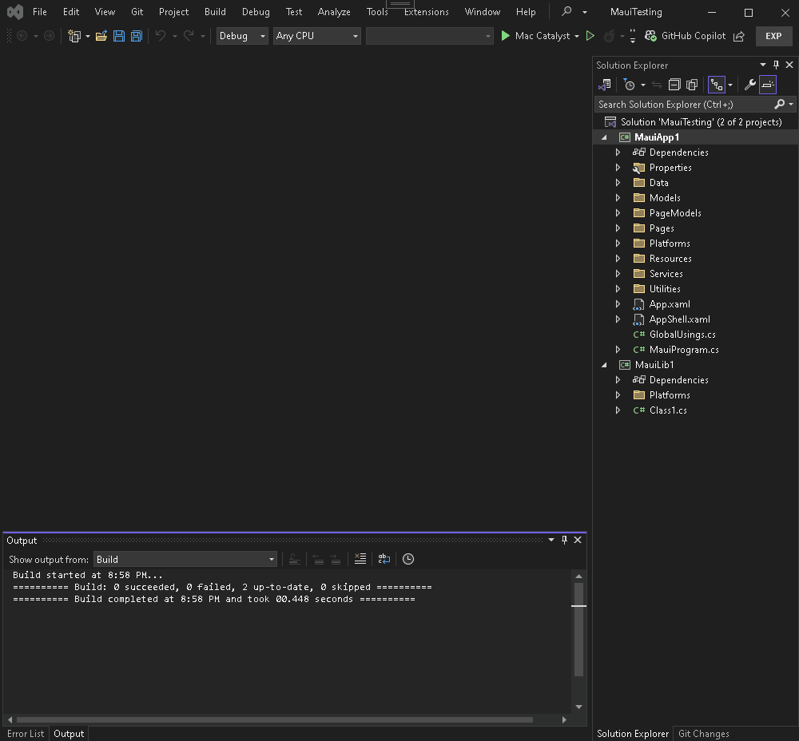

# Pair To MacCatalyst

## Overview

  
  Sick of this useless VS operation for .Net Maui apps on VS 2022 for Windows?

This Visual Studio 2022 extension allows you to pair to a Mac device to build, clean, 
debug, deploy and rebuild .Net Maui Mac Catalyst apps on the remote device from Windows. This
offers the same functionality as Pair To Mac for iOS development for MacOS\Mac Catalyst.

# Features

    - Connects to MacOS device securely over SSH
    - Stores multiple devices for easily switch between development devices
    - Build, clean, debug, deploy, and rebuild Maui Mac Catalyst apps from Windows
    - Dotnet and Xcode requirement checks before pairing/connection

# How to Pair

Pair to Mac Catalyst mimics the same Pair To Mac dialog and functionability you've come to know 
and love in Visual Studio. 

# Operations

Operations are all wired into the Visual Studio build commands, as long as your active debug
profile is set to 'Mac Catalyst', the commands will execute operations on your remote MacOs
device.

# Comming Soon

    - Remote Vs debugging from Windows to MacOS
    - Deploy application from Windows 
    - VNC connection to running Mac Catalyst app from Windows

## License
[MIT](LICENSE)